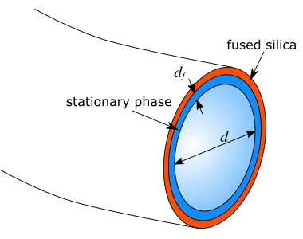
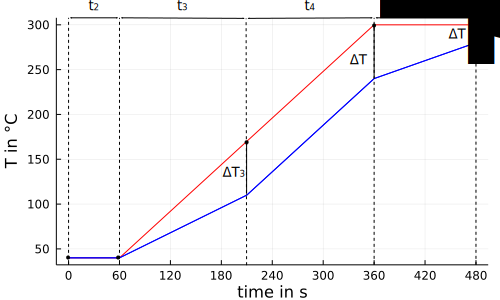

# Usage

In the following section the general usage and setup of the simulation is explained. 

A GC-system for the simulation is defined by four sets of parameters:

## GC Column parameters

A GC column is defined by the dimensions of the column, length `L`, diameter `d` and film thickness of the stationary phase `df`, all measured in meters, the name of the stationary phase and the name of the mobile phase (with the allowed values "He", "H2" and "N2").



These values are collected in the type structure [`GasChromatographySimulator.Column`](@ref), which allows to define a function depending on column position `x` of the diameter `d(x, a_d)` and film thickness `df(x, a_df)`, where `a_d`, resp. `a_df` are parameters of the function.

The following method constructs the Column structure `col` with a constant diameter and film thickness:

```@example ex
using GasChromatographySimulator # hide
col = GasChromatographySimulator.Column(10.0, 0.25e-3, 0.25e-6, "SPB50", "He")
nothing # hide
```

## Program parameters

The program for a GC separation is defined by a temperature program ``T(t)`` and a pressure program. Typically the inlet pressure is controlled over time ``p_{in}(t)`` and the outlet pressure is constant, but here the outlet pressure can also be a function of time ``p_{out}(t)``. In addition a thermal gradient can be applied, where the temperature of the GC column changes depending on position ``x`` on the column.

The program parameters are collected in the type structure [`GasChromatographySimulator.Program`](@ref).

Different methods exist to construct the Program structure, depending on the usage of a thermal gradient. In two examples the definition of the program parameters will be explained.

### Without thermal gradient

Without a thermal gradient the temperature is the same at every column position at the same time. This is the normal case for conventional GC. One example of such a program can be achieved by the following method [`GasChromatographySimulator.Program(time_steps, temp_steps, pin_steps, pout_steps, L)`](@ref), which constructs the Program structure:

```@example ex
prog = GasChromatographySimulator.Program(  [0.0, 60.0, 600.0, 120.0],
                                            [40.0, 40.0, 300.0, 300.0],
                                            [18.0, 18.0, 98.0, 98.0].*1000.0 .+ 101300.0,
                                            101300.0.*ones(4),
                                            col.L)
nothing # hide
```

The first array `time_steps` defines the time steps (in s), the second array `temp_steps` defines the temperatures (in °C) at these time steps, the third and fourth array (`pin_steps` and `pout_steps`) define the inlet and outlet pressures (both in Pa(absolute)) at the time steps. The values of temperature and pressures change linearly between the values defined at the time steps. The following picture shows the resulting temperature and pressure program:


The first time step is always zero (t₁ = 0.0 s) and the following time steps define the time that passes until the next step. In the example the second time step is t₂ = 60 seconds long and in this time the temperature stays constant at 40°C. With the next time step (t₃ = 600 s) the temperature changes from T₂ = 40°C linearly to T₃ = 300°C. In the last time step (t₄ = 120 s) the temperature is again kept constant at 300°C. The pressure program is defined in the same way. The inlet pressure changes similarly at the time steps, while the outlet pressure is constant.

The four arrays for time steps, temperatures and the two pressures must have the same number of elements, otherwise the construction of the Program structure gives an error message. Complex programs with several different heating ramps and temperature plateaus, as well as programed pressures, e.g. pressure pulses, can be realized by adding the temperature/pressure values at additional time steps. 

### Thermal gradient

#### Predefined gradient function

In the following text the expression _temperature program_ means the change of the temperature with time `t`, while the expression _temperature gradient_ means the change of the temperature with column position `x`.

In addition to a linear temperature and pressure program , a temperature gradient can be defined. Using the method [`GasChromatographySimulator.Program(time_steps, temp_steps, pin_steps, pout_steps, a_gf, Tcontrol, L)`](@ref) a pre-defined temperature function `gf(x)` is used to set the GC program.

```@example ex
prog_g = GasChromatographySimulator.Program([0.0, 60.0, 150.0, 150.0, 120.0],
                                            [40.0, 40.0, 170.0, 300.0, 300.0],
                                            150000.0.*ones(5),
                                            101300.0.*ones(5),
                                            [[0.0, 0.0, 60.0, 60.0, 20.0] zeros(5) col.L.*ones(5) [0.0, 0.0, -2.0, -5.0, -5.0]],
                                            "inlet",
                                            col.L)
nothing # hide
```

Similar to the setup before, the arrays `time_steps`, `temp_steps`, `pin_steps` and `pout_steps` are used. Added are the the array `a_gf`, containing the parameters for the temperature function `gf(x)` and the option `Tcontrol` (with options "inlet" and "outlet"), which defines at which position of the column the temperature program is defined (`Tcontrol = "inlet"` ... temperature program defined at `x=0`; `Tcontrol="outlet"` ... temperature program defined at `x=L`). The following picture shows the resulting temperature program at the column inlet and outlet:



The parameters of the pre-defined gradient function `gf(x)` consists of four arrays with the same length as the array `time_steps`. These four arrays represent four different parameters:
- `ΔT` ... the temperature difference between `x = x₀` and `x = x₀ + L₀`
- `x₀` ... the start position, typically `x₀ = 0.0`
- `L₀` ... the distance from the start position, typically `L₀ = L`
- `α` ... the gradient profile factor

The form of the gradient function can change over time. For every parameter the same number of values as the number of `time_steps` are defined and different gradient functions at the different `time_steps` are defined. For times between the `time_steps` the gradient function at a fixed position changes linearly in time between the values at the surrounding `time_steps`. 

The pre-defined gradient function distinguishes two cases for the gradient profile factor. For `α<=0` it is defined as

``gf(x) = ΔT  \left( 1 - \exp{\left(α \left( 1 - \frac{x - x_0}{L_0}\right)\right)} + \left(1 - \frac{x - x_0}{L_0}\right) \exp{(α)}\right)``

For `α>0` it is defined as

``gf(x) = ΔT  \left(\exp{\left(-α \frac{x - x_0}{L_0}\right)} - \frac{x - x_0}{L_0}\exp{(-α)}\right) ``

The following graph shows different gradient functions for different profile factors `α` (`ΔT = 50°C`, `x₀ = 0.0m` and `L₀ = 10.0m`). 


For `α=0` a linear change of the temperature along the column is achieved. For negative `α`-values the gradient has a concave profile, with small changes of the temperature near the inlet and great changes towards the outlet. For positive `α`-values the gradient has a convex profile, with great changes near the inlet and small changes towards the outlet.

From the parameters `time_steps`, `temp_steps`, `a_gf` and gradient function `gf(x)` the temperature at every position `x` and every time `t` is linearly interpolated in a function `T_itp(x,t)`, which is stored in the [`GasChromatographySimulator.Program`](@ref) structure. The parameters `time_steps` and `pin_steps`, resp. `pout_steps`, are used to construct the linear interpolated pressure function in time `pin_itp(t)`, resp. `pout_itp(t)`. These interpolated functions are used throughout the simulation.


## Substance parameters

A third set of parameters, [`GasChromatographySimulator.Substance`](@ref), is used to store the informations about the substances which are separated in the simulated GC-run. The stored information are the name, the CAS-number, three thermodynamic parameters (`Tchar` `θchar` `ΔCp`, see also [`6`](https://janleppert.github.io/GasChromatographySimulator.jl/dev/references/#References)), the dimensionless film thickness (df/d) of the Column for which the thermodynamic parameters were estimated, the diffusivity (calculated from the molecular formula, number of rings in the molecule and mol mass), the injection time and initial peak width. For several substances an array of the type [`GasChromatographySimulator.Substance`](@ref) is used.

With the function [`GasChromatographySimulator.load_solute_database`](@ref) the data for selected substances and a selected stationary phase is loaded from an external database (a .csv-file).

```@example ex
stat_phase = col.sp
solutes = ["C10", "C11", "C12", "2-Octanol", "2-Octanone"]
t₀ = zeros(length(solutes))
τ₀ = zeros(length(solutes))
sub = GasChromatographySimulator.load_solute_database("../../data", "Database_test.csv", 
                                                        stat_phase,
                                                        col.gas,
                                                        solutes,
                                                        t₀,
                                                        τ₀)
```

An example database [`Database_test.csv`](https://github.com/JanLeppert/GasChromatographySimulator.jl/blob/main/data/Database_test.csv) with thermodynamic data from [Blumberg2017a] can be found in the folder `/data` of this github project, see also [`Database`](#Database).

## Option parameters

A fourth set of parameters, [`GasChromatographySimulator.Options`](@ref), holds additional options used in the simulation. For details see the docstring.

The default options can be initialized by calling:
```@example ex
opt = GasChromatographySimulator.Options()
```

## Combining the parameters

The four sets of parameters defining the simulation are collected in the type structure [`GasChromatographySimulator.Parameters`](@ref). All information for the simulation are contained in this structure.

```@example ex
par_g = GasChromatographySimulator.Parameters(col, prog_g, sub, opt) 
nothing # hide
```

## Run the simulation and evaluate the results

The GC-system is simulated by numerically solving two ordinary differential equations (ODE):

The first ODE describes the migration ``t(x)`` of a substance through the GC column with the velocity ``u(x,t)``:

``\frac{dt}{dx} = \frac{1}{u(x,t)}``

The second ODE describes the development of the temporal peak variance ``\tau^2(x,t(x))`` during the migration:

``\frac{dτ^2}{dx} = H(x, t(x)) r(x, t(x)) + 2 τ^2(x, t(x)) \frac{∂r}{∂t}(x,t(x))``

Hereby is ``r(x,t)`` the inverse velocity of the substance (``1/u(x,t)``, also called residency) and ``H(x,t)`` is the local plate height. For more information about the physical model see the [`docstrings of the physical model`](https://janleppert.github.io/GasChromatographySimulator.jl/dev/functions/#Physical-Model) and the references [`7`](https://janleppert.github.io/GasChromatographySimulator.jl/dev/references/#References) and [`8`](https://janleppert.github.io/GasChromatographySimulator.jl/dev/references/#References).

With the argument `odesys` of [`GasChromatographySimulator.Options`](@ref) the two differential equations can be solved as a system of ODEs (`odesys = true`) or separately, using the solution of the first ODE to solve the second ODE (`odesys = false`).   

With the function [`GasChromatographySimulator.simulate`](@ref) the simulation is initiated.

An example of the above defined GC Column `col`, with a temperature gradient program `prog_g`, the five substances `sub` and the default options `opt` (collected in the parameters `par_g`) is simulated by 

```@example ex
peaklist, sol = GasChromatographySimulator.simulate(par_g)
nothing # hide
```

The simulation gives two resulting quantities. In the `peaklist` the general results of the simulated GC-run are presented in a DataFrame:

```@example ex
peaklist # hide
```

- Name          ... name of the substance
- tR            ... retention time in s
- τR            ... peak width at retention time in s
- TR            ... elution temperature (temperature of the column outlet at retention time) 
- σR            ... band width at retention time in m
- uR            ... velocity of the substance at retention time in m/s
- kR            ... retention factor at retention time
- Res           ... resolution between the substance and its following neighbor

From the `peaklist` a chromatogram can be calculated (gaussian peak form with the same area are assumed) and plotted:

```@example ex
using Plots; gr() # hide
p_chrom, t, abundance = GasChromatographySimulator.plot_chromatogram(peaklist, (100.0, 200.0))
savefig(p_chrom, "plot_chromatogram.png"); nothing # hide
```


 
The solution of the ODEs are stored in `sol` as an array of solutions from the [`DifferentialEquations.jl`](https://github.com/SciML/DifferentialEquations.jl) package. The solution for the first substance (C10) is:
```@example ex
sol[1] # hide
```

Herby is `sol[1].t` the position `x` along the column and `sol[1].u` consists of an array of the corresponding time `t` and peak variance `τ²`.

The solution `t(x)` can be plotted by

```@example ex
p_tx = plot(sol[1], vars=1)
savefig(p_tx, "plot_tx.png"); nothing # hide
```


The solution `τ²(x)` can be plotted by
```@example ex
p_τ²x = plot(sol[1], vars=2)
savefig(p_τ²x, "plot_tau2x.png"); nothing # hide
```


## Notes

### Self-defined gradient function

It is possible to define other gradient function beside the pre-defined function above. The following example shows the construction of the [`GasChromatographySimulator.Program`](@ref) structure with a `sin` function with a changing period over the time of the program:

```julia
L = 10.0
time_steps = [0.0, 60.0, 150.0, 150.0, 120.0]
temp_steps = [40.0, 60.0, 170.0, 300.0, 350.0]
pin_steps = 150000.0.*ones(length(time_steps))
pout_steps = zeros(length(time_steps))
a_gf = [[10.0, 10.0, 30.0, 30.0, 10.0] [1.0, 1.0, 1.0, 2.0, 4.0]]
gradient_function(x) = a_gf[:,1].*sin.(a_gf[:,2].*2*π/L*x)
T_itp = GasChromatographySimulator.temperature_interpolation(time_steps, temp_steps, gradient_function, L)
pin_itp = GasChromatographySimulator.pressure_interpolation(time_steps, pin_steps)
pout_itp = GasChromatographySimulator.pressure_interpolation(time_steps, pout_steps)
prog = GasChromatographySimulator.Program(time_steps, temp_steps, pin_steps, pout_steps, gradient_function, a_gf, T_itp, pin_itp, pout_itp)
```

This program results in the following gradient.


The solid lines show the defined gradient functions at the five `time_steps`. The two dashed lines show the gradient at two different times between the third and fourth `time_steps`. They show the transition between the two defined functions.

Note: Not fully tested yet.

### Database

The layout of the database in the .csv-file is shown here:

```@example database
using DataFrames, CSV # hide
db = DataFrame(CSV.File("../../data/Database_test.csv", header=1, silencewarnings=true, limit=3))
```

It consists of 14 different columns:
- Name          ... name of the substance
- CAS           ... CAS number for unique identification of the substance
- Cnumber       ... number of carbon atoms in the substance molecule
- Hnumber       ... number of hydrogen atoms in the substance molecule
- Onumber       ... number of oxygen atoms in the substance molecule
- Nnumber       ... number of nitrogen atoms in the substance molecule
- Ringnumber    ... number of ring structures in the substance molecule
- Molmass       ... molar mass of the substance molecule
- Phase         ... name of the stationary phase which corresponds to the thermodynamic parameters
- Tchar         ... the first thermodynamic parameter in °C
- thetachar     ... the second thermodynamic parameter in °C
- DeltaCp       ... the third thermodynamic parameter in J mol⁻¹ K⁻¹
- phi0          ... the dimensionless film thickness (df/d) for which the thermodynamic parameters were estimated
- Annotation    ... a note, e.g. reference for the thermodynamic parameters
