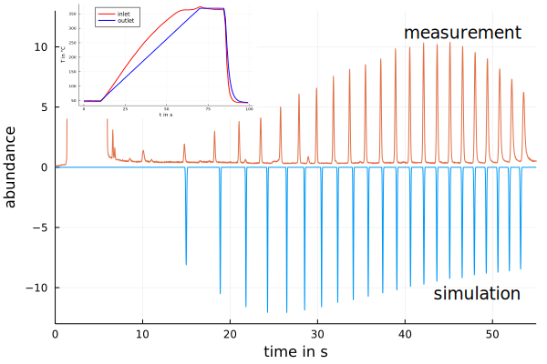

# Summary

Gas chromatography is a technique used in analytical chemistry to separate a mixture of vaporizable substances by injecting the mixture into a gas stream (mobile phase), which passes along a tube, called column, of length $L$ and diameter $d$. The column is coated with a stationary phase of a film thickness $d_f$. The substances of the mixture interact with the stationary phase by partition between mobile and stationary phase, resulting in different effective velocities of the substances. At the end of the column the substances are registered in a detector at different times, called retention times, and with different peak widths, resulting in a chromatogram. Gas chromatography is used for qualitative and quantitative analysis, e.g. in petro chemistry, food chemistry, environmental analytics and forensic science.

The modeling of GC separations is used for the prediction of retention times and widths of the signals. With these results the separation of substances can be evaluated via the resolution of neighboring substance peaks in the chromatogram. Such simulations are of interest for method development, especially in multidimensional GC [@Hou:2018; @Jaramillo:2020; @Gaida:2021] and for the evaluation of new techniques, like thermal gradient GC [@Leppert:2020b] or stationary phase thickness gradients [@Li:2020]. While the presented package only models the one dimensional GC separation, it can be used as the base for a multi-dimensional GC separation.

# Statement of need
`GasChromatographySimulator.jl` is a Julia package [@Julia] to simulate the separation of a number of substances in a gas chromatographic (GC) system with programmed temperature $T(t)$ and programmed inlet pressure $p_{in}(t)$ resp. programmed flow $F(t)$ . In principle, the outlet pressure can also be programmed $p_{out}(t)$. The package also allows for spatial changes of the diameter of the GC column $d(x)$, of the film thickness of the stationary phase $d_f(x)$ and of the temperature $T(x)$. The simulation is based on solving a system of ordinary differential equations (ODE) for the migration of the substances through the GC system $t(x)$ and for the development of the temporal variance of the substance distribution $\tau^2(x,t)$.

The ODE system for migration $t(x)$ and temporal variance development $\tau^2(x,t)$ is:  
$$
\frac{dt}{dx} = r(x,t)
$$
and
$$
\frac{d\tau^2}{dx} = H(x,t)r(x,t) + 2 \tau^2(x,t) \frac{\partial r(x,t)}{\partial t}
$$
with $r$ the inverse substance velocity ($r=1/u$) and $H$ the local plate height, [@Leppert:2020a], on the interval of $0 \leq x \leq L$, where $L$ is the length of the column. The basic equations building the model are presented in an earlier publication [@Leppert:2020b] and can be found in the documentation of the package. This ODE system is solved by using the Julia package `DifferentialEquations.jl` [@DifferentialEquations].

`GasChromatographySimulator.jl` provides an interface to define a GC system consisting of: 

- column (length, diameter, film thickness, type of stationary and mobile phase, optional spatial change of diameter and/or film thickness) 
- program (temperature and pressure program, optional thermal spatial change)
- substance parameters (thermodynamic parameters, diffusion coefficient, time of injection, width at injection)
- additional options (e.g. tolerances, algorithm for solving ODEs, model of viscosity) 

By providing the thermodynamic parameters [@Blumberg:2017] for the interaction of substances and stationary phase, which can be estimated by isothermal GC measurements, the separation of mixtures of substances can be simulated for a wide range of GC systems. 

Fig. \autoref{fig:example} shows the simulation of a separation with thermal gradient of n-alkanes and compares it to a real measurement from [@Leppert:2020b].

A collection of `Pluto.jl` notebooks [@Pluto] are made available together with this package to provide a simple user interface to setup and simulate arbitrary GC systems for users with less coding experience.

This package is unique because it allows to simulate GC systems with non-uniform diameter, stationary film thickness and temperature. Available simulations, like published as supplemental material for [@Gaida:2021] or [@Hou:2018], are only able to simulate conventional GC. A commercial but free to use simulation software is Pro EZGC by Restek Corporation [@ProEZGC], which only allows the simulation of conventional GC for defined stationary phases (produced by Restek) and defined substances.

A full investigation of the properties of thermal gradient GC using `GasChromatographySimulator.jl` is in preparation. Also a project [`ThermodynamicDataEstimator`](https://github.com/JanLeppert/ThermodynamicDataEstimator) to determine the thermodynamic parameters of substances based on optimization to match measured retention times in temperature programmed GC, similar to [@Hou:2018], is in development. The package `GasChromatographySimulator.jl` is a foundation for this project. 

# Acknowledgment
Jan Leppert is supported by the DFG research grant 452897652.

# References

